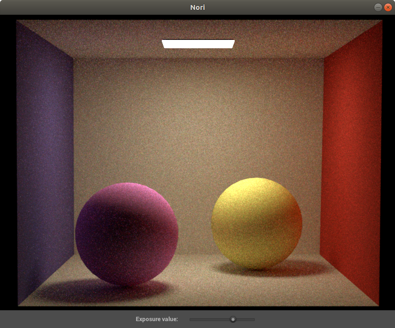
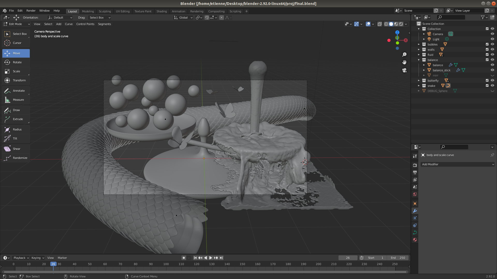

**Final Project**

Student name: Etienne Salimbeni

Sciper number: 270963

Goal
====

Implement a spectral ray tracer to render wavelenght specific effects , in particular the thin film irredescence like the images below : 

Spectral Ray-tracing
====================

The idea behind the spectral ray-tracer is to take into account the wavelenght for each simulated ray and make each object interaction with the ray wavelenght dependent. 

My main reference is the project report of the work of Cecilia Zhang, Ashwinlal Sreelal, Justin Comins :
https://ceciliavision.github.io/graphics/a6/

## Spectral Camera

To achieve this, an new parameter wavelenght (wl) is added to the Ray class ,also the camera randomly generates rays with wl between 400 nm and 700 nm (the visible scpectrum).

   

As showed in the renders above , this methods requires at least 3 times more samples to get an image , as each ray will only contribute its color.
In the image you can see the render converge from 1 sample to 32 samples.

## Spectral Integrator

All integrators had to be updated to take into account the new parameter wavelenght of the ray.
Every time a ray was copied or created , it had to keep the same wavelenght.

Currently the PathMisIntegrator and WhittedIntegrator are updated.

## Diffuse spectral BSDF ( Albedo spectral )

When a ray intersect a diffuse surface only some wavelenghts are going to be absorbed and other reflected with differents degrees.

This can easily become a very complex task , as every material have different absorbsion spectra and this would require to store a spectra for each material.

The shortcut used here is to convert each RGB values to a spectra. 
This can be done beacuse the human eye is sensible to those 3 colors at very specific wavelengts 
(look at the spectra below) due to the sensitivy of each cone type.

    
    [image source](https://www.unm.edu/~toolson/human_cone_response.htm)

The follwing formula : 

$$ Albedo_{spectral} = \frac{Albedo_{red}}{\lambda - 575} + \frac{Albedo_{green}}{\lambda - 535} + \frac{Albedo_{blue}}{\lambda - 445} $$

( where $Albedo$ is the RGB of the given material and $\lambda$ the wavelenght a the given ray ) takes into account the human eye
absorption to give an appropriate response. This tricks is implemented for each BSDF and yields satfisfactory 
results like in the image of the last section.

Note that in the version the value that is incremented is not the intensity (usually spectral renderers use the XYZ intensities and then convert to RGB)
but directly accumulating RGB responses. One big plus of this technic is that all other bsdf, can be added to the scene even if they are not spectral.
For example this spectral ray tracer can also render to the non-spectral microfacet BSDF implemented in the previous HW.

When it comes to the implementation , a new BSDF class diffuse_spectral simply is a copy of the diffuse BSDF but apply the albedo spectral formula to output the RGB response.

## Dielectric spectral BSDF ( difraction index )

Now with a spectral renderer it is possible to have dielectric materials that only allow some specific wavelenghts , 
as u can see in the next 2 images (left with range [570nm,600nm] and right with range [450nm , 451nm] ). 

    
    

One other interesting aspect of the spectral ray tracer is to simplify the implementation for the difraction effect. (chromatic aberation)
Just updating the diffraction index allowing them to change according to the wavelenght of the ray will generate interesting effects.

    
    

    
    

A new class dielectric_spectral is created for this part , it is a copy of the dielectric BSDF , just that instead of having a fixed index of diffraction 
it uses one that is wavelenght dependent. I have played with some "made up" diffraction functions to emphasise the effect of the diffraction , as u can see in the examples. Otherwise , for 
more physically based behaviours , a diffraction index spectra for each material should have been implemented.

## Black Body Emitter

Another advantage of using a spectral ray tracer is to use wavelenght dependent emitters, which gives a more natural look to the scene.
This can be done by applying Planks law as the return value of the emitter given a specific temperature.

    $$ I(\lambda , T)  = \frac{2hc^2}{\lambda^5} \frac{1}{e^{\frac{hc}{\lambda k_bT}-1}} $$  
    

This can create warm and cold lights like the examples below one image at 3500K (left) and the other at 7000K (right) : 

    
    

Note that the exposure values had to be scaled to get comparable images. As Plank law get very drastic changes in intensity.

A new class BlackBodyEmitter is created , that given a Ray (thus also its wavelenght) return the intensity of it according to Planks Law.
Note that all operations of constants of the formula are precomputed to avoid numerical floating point errors.

Lastly , because this Spectral Ray Tracer is not computing the intensities , but directly RGB values , the output of the emmiter is scale.

Thin Film Irridescence
======================

With a spectral ray tracer wavelenght effect such as light interferences. 
Two ray can cancel eahother (destructive) or amplify (constructive) depending on the phase difference of the two rays.

Thin film irridescence is an optical effect that is due to this light interference. 
When a ray intersect a thin film , some light will directly bounce back ( ray b ) and some bounce inside the thinfilm ( ray c ).

Because the thin film is 'thin' the ray b and c will be very close except for their phase shift as ray c has traveled more.
The extra distace if ray c is : $$ shift = d + \frac{\lambda}{2} = 2wncos(\theta_t) + \frac{\lambda}{2}$$

    

    [image source](https://en.wikipedia.org/wiki/Thin-film_interference)

the principle is the same for a soap bubble , excpet that the ray can also pass trough the bubble : 

    
    
    [image source](https://en.wikipedia.org/wiki/Thin-film_interference)

Thanks to the spectral ray tracer , it is straight forward to implement the thin film as we already have wavelenght dependednt ray.
The new class ThinFilmSpectral , is similar to dielectric , excpet it takes into the interference, given a specic lenght of the thin film 
and use the previous formula to get the shift.

In the following render , a soap bubble (left) and golden sphere covered with a thin film (right) , show the results yields by this technic

    

Note that in this implementation we are not taking into account multiple bounce within the thin film , as only one bounce yield satisfactory results.

Other configurations of the thinfilmspectral class with a black glass under the thin film : 

    

different thickness of the layers for soap bubble (from left to right : 500 nm , 700 nm , 1000 nm and 1500 nm) : 

    
    

    
    

Ideally the leayer thickness of the soap bubble is not constant bacause of gravity and wind ,
which creates the typical wavy rainbow look of the soap bubble. For simplicity a constant thickness is used.

Note that for the Thin Film Irridescence , as the effect is subtle , 
the code amplify the constructive signal to get more noticeable effects for the final render by simply 
scaling the a constructive signal signal by a constant. 

Another note is that because of the limitation of the current integrator, it is necessary to have all walls white arounf the irridescent object. 
For example in the final render , the entire scene is surrounded by white walls , that cannot be seen in the frame of the camera.
This is due to the fact that the rays are generated from the camera and not the emitter , thus they need to bounce on a diffuse surface to get the corresponding color.
This constraint can be solved by coding a more advanced type of integrator such as photon mapping.

EXTRA Features
==============

## Morpho butterfly BSDF

An attempt to reproduce the results from the paper : 

[A Physically Based Anisotropic Iridescence Model for Rendering Morpho Butterflies Photo-realistically
from : Iman Sadeghi , University of California, San Diego](https://citeseerx.ist.psu.edu/viewdoc/download?doi=10.1.1.497.4956&rep=rep1&type=pdf)

    

The limitation of the current ray tracer did not allow to use all the formulas of the paper.
Notice that the brightness of the color is not as pronounced as in the paper. 
Better results would be easier to implement with other technics like photon mapping , etc ...

Similarly , to the other section of the report , because this spectral ray tracer to not accumulate intensities but RGB responces,
the formulas had to be scaled too for this part.

    
    

## 3D blender Modeling

All models in the final render have been modelled from scratch.

But I would have been lost without the help of the best youtubers : 
[Blender Guru](https://www.youtube.com/watch?v=7a0cHFs7jkw) , 
[Mzero mm](https://www.youtube.com/watch?v=8CPLE6cC23s)

    
    
    
    

## Fluid Blender simulation

I have been playing for too long with many parameters of the fuild simulator.

    
    

Final render
============

<!--
    
-->

<!-- Slider -->

<link href="../resources/offcanvas.css" rel="stylesheet">
<link href="../resources/twentytwenty.css" rel="stylesheet" type="text/css" />

<!-- Markdeep: -->

